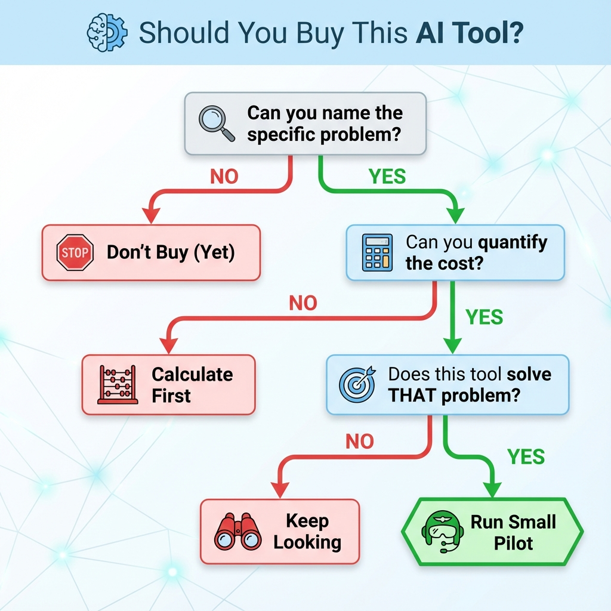

# Awesome AI Marketing: Best AI Marketing Tools for 2026

> A curated list of AI tools and prompts worth testing for marketing.

⭐ If you find this useful, give it a star and share it with other marketers navigating the AI noise.

---

## Table of Contents

- [Prompts & Frameworks (Start Here)](#prompts--frameworks-start-here)
- [Content Creation](#content-creation)
- [SEO & Search Optimization](#seo--search-optimization)
- [Social Media Management](#social-media-management)
- [Video & Visual Content](#video--visual-content)
- [Email Marketing](#email-marketing)
- [Customer Service & Chatbots](#customer-service--chatbots)
- [Analytics & Insights](#analytics--insights)
- [Competitive Intelligence & Market Research](#competitive-intelligence--market-research)
- [Ad Creative & Copy](#ad-creative--copy)
- [Landing Pages & Conversion Optimization](#landing-pages--conversion-optimization)
- [Workflow Automation](#workflow-automation)
- [How to Use This List](#how-to-use-this-list)
- [Contributing](#contributing)

---

## Prompts & Frameworks (Start Here)

**Philosophy:** Before paying for tools, try these prompts with ChatGPT/Claude. Many "AI marketing tools" are just wrappers around prompts like these.

### Essential Prompt Resources

- [Anthropic's Prompt Library](https://platform.claude.com/docs/en/resources/prompt-library/library) - High-quality optimized prompts from the Claude team for a variety of business and personal tasks.
- [Awesome ChatGPT Prompts](https://github.com/f/awesome-chatgpt-prompts) - In this repository (139k+ GitHub stars), you will find a wide variety of prompts that can be used with ChatGPT, Claude, Gemini, Hugging Face Chat, Llama, Mistral and other AI chat models.
- [OpenAI's Prompting Guide](https://platform.openai.com/docs/guides/prompting) - Prompting is the process of providing input to a model. The quality of your output often depends on how well you're able to prompt the model. Learn strategies, techniques, and tools to construct prompts (with code examples).
- [Semrush AI Prompt Library for Content Marketers](https://www.semrush.com/content-hub/ai-prompt-library/) - 600+ tested prompts organized by category (content ideation, SEO, audience research) with placeholder fields for immediate use
- [HubSpot AI Prompt Libraries](https://offers.hubspot.com/ai-prompt-library) - A curated collection of AI prompts designed to unlock unconventional marketing strategies
- [AI Prompt Engineering for Digital Marketers](https://maxbraglia.substack.com/p/the-complete-prompt-engineering-toolkit) - A practical guide to getting better results from AI tools like ChatGPT, Claude, and Gemini.

### When to Use Prompts vs Tools

**Use raw prompts when:**

- You run this task <10 times per month
- You're comfortable with ChatGPT/Claude interface
- Budget is tight

**Use specialized tools when:**

- You run this task daily
- You need team collaboration features
- The tool adds genuine features beyond prompting (data integrations, workflow automation, etc.)

**Example:** Don't pay for a "social media post generator" that's just ChatGPT with a prompt. DO pay for Buffer if you need scheduling, team approval workflows, and analytics.

**💡 Pro Tip:** Start with prompts. Only upgrade to paid tools when you've proven the workflow is valuable and the tool adds real features beyond better UI.

---

## Content Creation

### General Writing Tools

- **[ChatGPT](https://chatgpt.com/)** - The foundation. Start here before trying specialized tools.
- **[Claude](https://claude.ai)** - Better for long-form content and nuanced writing. Excels at maintaining context.

### Specialized Content Tools

- **[Jasper](https://jasper.ai)** - Jasper AI is an AI platform that helps marketing teams quickly generate blog posts, social media copy, emails, and images using natural language inputs, with features for SEO optimization and brand voice consistency.
- **[Copy.ai](https://copy.ai)** - Copy.ai is an AI platform that generates marketing copy, blog posts, emails, and social media content to help sales and marketing teams brainstorm ideas, summarize information, and scale personalized GTM processes efficiently.
- **[Writesonic](https://writesonic.com)** - Writesonic is an AI platform that generates articles, ads, product descriptions, and social media posts, with tools for SEO optimization and maintaining brand consistency to streamline marketing and writing tasks.
- **[Frase](https://frase.io)** - Frase.io is an AI platform that helps marketers and writers research keywords, analyze competitors, and optimize articles for SEO by drawing insights from top-ranking search results.
- **[Rytr](https://rytr.me)** - Rytr is an AI writing assistant that quickly generates blog posts, emails, ads, and social media content using prompts, templates, customizable tones, and support for multiple languages.
- **[Anyword](https://anyword.com)** - Anyword is an AI platform that generates, scores, and optimizes high-converting ad copy, emails, social media posts, and website content, using predictive analytics to forecast performance for specific audiences.
- **[Koala](https://koala.sh/)** - Koala AI is a suite of AI-powered tools for content creators, focusing on SEO-friendly article writing, with core features like KoalaWriter for generating long-form content
- **[NEURONwriter](https://neuronwriter.com/)** - NeuronWriter is an AI content optimization platform that uses generative AI and semantic SEO to help users create high-ranking Google content, with real-time suggestions for keywords, topics, structure, and internal linking based on competitor analysis.

---

## SEO & Search Optimization

### Traditional SEO with AI

- **[Ahrefs](https://ahrefs.com)** - Industry-standard backlink and keyword research suite; AI Content Helper analyzes top-ranking pages to suggest improvements focused on search intent alignment.
- **[Semrush](https://semrush.com)** - Comprehensive SEO platform (55+ tools) with AI Copilot that surfaces prioritized recommendations daily; AI Visibility Toolkit now tracks brand presence in ChatGPT, Perplexity, and AI Overviews.
- **[Rank Math](https://rankmath.com)** - WordPress SEO plugin with 3M+ installs; AI assists with meta tags, schema markup, and on-page optimization. Best free option for WordPress sites.
- **[Surfer SEO](https://surferseo.com)** - On-page optimization platform that analyzes top-ranking competitors; AI-powered content editor scores your drafts against data-driven recommendations for keywords, structure, and length.
- **[Clearscope](https://clearscope.io)** - Content optimization tool with AI-powered grading; scores content in real-time with specific term recommendations. Integrates with Google Docs and WordPress. Enterprise-focused.
- **[Ubersuggest](https://neilpatel.com/ubersuggest/)** - Budget-friendly SEO suite for keyword research, site audits, and competitor analysis; AI Writing Assistant generates SEO-optimized content ideas. Ideal for beginners and small businesses with generous free tier.

### AI Search Optimization (AEO)

- **[SE Ranking AI Overviews Tracker](https://seranking.com/ai-overviews-tracker.html)** - Tracks your website's visibility specifically within Google AI Overviews—shows which keywords trigger AI answers and which sources get cited.
- **[Otterly.AI](https://otterly.ai)** - Real-time AI search monitoring with daily citation updates across ChatGPT, Perplexity, and Google AI Overviews; includes Slack alerts when citations appear or disappear.

---

## Social Media Management

- **[Buffer](https://buffer.com)** - AI Assistant detects which platform you're writing for and adapts output accordingly—turns one idea into 10 tailored posts with proper formatting and tone.
- **[Later](https://later.com)** - Visual-first scheduling optimized for Instagram grids and visual feeds; AI suggests best times to post and hashtags based on your audience engagement patterns.
- **[Typefully](https://typefully.com)** - Minimalist writing and scheduling for X, LinkedIn, Threads, and Bluesky; distraction-free editor excels at crafting threads with AI suggestions to sharpen your copy. Popular with creators and founders.
- **[ContentStudio](https://contentstudio.io)** - Tracks trending content across topics with sentiment analysis and suggests sharing opportunities; Chat AI assistant with prompt library adds real value.
- **[Taplio](https://taplio.com)** - LinkedIn specifically. Content creation + engagement. Actually generates B2B leads.
- **[FeedHive](https://feedhive.com)** - Auto-generates posts from prompts, predicts performance before publishing, and recycles evergreen content with conditional posting that fires actions when engagement hits targets.
- **[Predis.ai](https://predis.ai)** - Generates complete Instagram carousels with coherent design from 4-word prompts, plus video posts using matched stock footage; includes competitor analysis.
- **[Flick](https://flick.social)** - AI copilot "Iris" brainstorms post ideas in stages—starts with concepts, develops full posts, then repurposes for each channel with hashtag generation.
- **[Ocoya](https://ocoya.com)** - All-in-one dashboard writes captions, picks hashtags, and creates post graphics together; strong ecommerce integrations for product-focused posting.
- **[Expandi](https://expandi.io)** - LinkedIn automation for outreach. Use carefully to avoid being flagged.

---

## Video & Media Content

### Visual & Content

- **[Fal](https://fal.ai/)** - A developer-focused generative media platform: Access the world's top image, video, and audio generation models in one hub. Build and fine-tune with serverless GPUs and on-demand clusters. Currently my go-to for media content creation.
- **[Canva Magic Studio](https://canva.com/magic/)** - Canva Magic Studio is Canva's suite of AI tools for generating designs from text prompts, creating images, editing photos (e.g., Magic Grab, Expand), and transforming content (e.g., Magic Switch for resizing, translating, or reformatting).

### Video Content

- **[Descript](https://descript.com)** - Edit video by editing text—delete a word, clip gets cut; removes filler words in one click, clones voice for corrections, generates social clips automatically.
- **[Otter.ai](https://otter.ai)** - Otter is the AI Meeting transcription that makes content repurposing trivial with transcription, automated summaries, AI Chat, and more.
- **[Synthesia](https://synthesia.io)** - Creates videos with 230+ realistic AI avatars speaking 140+ languages—no camera or actors needed; used by 100K+ businesses for training and marketing.
- **[InVideo AI](https://invideo.io)** - Converts scripts, articles, or prompts into full videos with auto-selected stock footage, music, and transitions; 4,000+ templates for different platforms.
- **[OpusClip](https://opus.pro)** - Analyzes long podcasts/webinars and auto-generates 10+ short clips with captions, AI-selected hooks, and virality scores.
- **[HeyGen](https://heygen.com)** - AI avatars for UGC-style marketing videos with voice cloning in 175+ languages and lip-sync translation; generates videos directly from product URLs.
- **[Fliki](https://fliki.ai/)** - Text-to-video platform with 2,000+ AI voices in 80+ languages; turns scripts, blog posts, or URLs into videos with auto-matched stock footage and voiceovers. Strong for YouTube Shorts, TikTok, and repurposing written content.

---

## Email Marketing

Most email platforms remain fundamentally traditional tools—list management, templates, automation workflows—with AI features layered on top. The AI additions (send-time optimization, subject line generation, predictive analytics) genuinely save time but rarely transform outcomes. Focus on choosing a platform that fits your business model first, then leverage whatever AI features come included.

- **[Klaviyo](https://klaviyo.com)** - The ecommerce email standard, especially for Shopify. Predictive analytics forecast customer lifetime value and churn risk; Segments AI builds complex audiences from plain-language prompts. Premium pricing but deep integration with shopping platforms justifies it for serious stores.
- **[Mailchimp](https://mailchimp.com/solutions/ai-tools/)** - Still the name everyone knows. Send Time Optimization analyzes historical patterns; AI generates on-brand emails with pre-built flows. Good all-rounder but increasingly expensive as you scale—many outgrow it.
- **[ActiveCampaign](https://activecampaign.com)** - Automation powerhouse with Predictive Sending that analyzes individual contact behavior for optimal timing per recipient. 93.4% deliverability rate. Steeper learning curve but rewards the investment.
- **[Kit](https://kit.com)** (formerly ConvertKit) - Creator-focused platform for newsletters, courses, and digital products. AI writing assistant for emails and landing pages; integrates with external AI tools. The go-to for solo creators and small teams who want simplicity.
- **[Omnisend](https://omnisend.com)** - Ecommerce-specific with predictive product recommendations, abandoned cart automation, and cross-channel SMS from one dashboard. Strong Shopify/WooCommerce alternative to Klaviyo at lower price points.
- **[Brevo](https://brevo.com)** - Budget-friendly option with "Aura" AI assistant for send-time optimization, subject lines, and auto-segmentation. Generous free tier makes it ideal for startups and small businesses testing email marketing.
- **[MailerLite](https://mailerlite.com)** - Clean, affordable platform with AI writing assistant and smart sending. Notably supports Model Context Protocol (MCP) for integrating external AI tools like Claude or ChatGPT into campaign workflows—unusual for this price tier.
- **[Lavender.ai](https://lavender.ai)** - Sales email coach, not a sending platform. Scores your draft and shows exactly why it might fail before you hit send. Integrates with Gmail/Outlook. For SDRs and sales teams writing cold outreach.
- **[Instantly.ai](https://instantly.ai)** - Cold email infrastructure for outbound at scale. AI personalization that doesn't sound templated, plus deliverability tools to avoid spam folders. For agencies and sales teams doing volume prospecting.

---

## Customer Service & Chatbots

- **[Zendesk AI Agents](https://zendesk.com/service/ai/)** - The 800-pound gorilla with 170,000+ customers and ~15% market share. Autonomous agents resolve up to 80% of interactions; Agent Copilot guides human agents with real-time suggestions. Enterprise-grade but increasingly expensive—many mid-market companies are exploring alternatives.
- **[Fin](https://fin.ai/)** - Intercom's standalone AI agent, now available with any helpdesk (Zendesk, Salesforce, or Intercom's own). Resolves over a million tickets weekly; powered by proprietary "Fin AI Engine" with 40+ ML engineers behind it. Can integrate with your existing setup or pair with Intercom's helpdesk. Strong in SaaS and tech companies.
- **[Freshdesk Freddy AI](https://freshworks.com/freshdesk/)** - Budget-friendly enterprise option with 50,000+ customers including HP and Honda. Intelligent ticket triaging, auto-responses, and intent detection; claims up to 60% productivity boost. Setup in minutes, not weeks. The value pick for growing companies.
- **[Tidio Lyro](https://tidio.com/lyro/)** - SMB darling with 300,000+ businesses. Powered by Claude with strict knowledge-base grounding to prevent hallucinations. Free tier and visual flow builder make it accessible for small teams just starting with automation.
- **[Gorgias](https://gorgias.com)** - E-commerce specialist with 15,000+ merchants (40% of Shopify's top 250). AI automates up to 60% of support while agents edit orders, process refunds, and manage subscriptions without leaving the platform. Usage-based pricing ($10/month for 50 tickets) fits seasonal businesses.
- **[Ada](https://ada.cx)** - Enterprise unicorn ($1.2B valuation, $70M+ ARR) serving brands like Verizon, Canva, and Square. AI agents achieve up to 83% automated resolution across chat, voice, email, and social. No-code platform but enterprise pricing and sales process—this is for large-scale deployments, not SMBs.

---

## Analytics & Insights

- **[Claude](https://claude.ai)** - Upload spreadsheets, CSVs, or exports from GA4/social platforms and ask questions in plain English. Artifacts feature visualizes data as interactive charts. Strong at pattern recognition and explaining findings in context.
- **[ChatGPT](https://chatgpt.com)** - Similar capability for conversational data analysis. Code Interpreter handles complex transformations; useful for quick exploration of marketing datasets without touching SQL.
- **[Julius.ai](https://julius.ai)** - Purpose-built for data analysis rather than general chat. Handles larger datasets and more complex operations than general-purpose LLMs; generates Python/R code you can audit and reuse.
- **[Mixpanel](https://mixpanel.com)** - Event-based product analytics with AI-powered insights; tracks user behavior across web and mobile with anomaly detection and funnel analysis that marketers can use without SQL.
- **[Amplitude](https://amplitude.com)** - Enterprise product analytics with predictive analytics and behavioral cohort analysis; uses ML to forecast conversion probabilities and identify at-risk users.
- **[Northbeam](https://northbeam.io)** - Multi-touch attribution using ML to track customer journeys across all channels; combines first-party pixel tracking with media mix modeling for real-time ROI visibility.
- **[Tableau AI](https://tableau.com)** - Industry-leading visualization enhanced with generative AI that automatically surfaces trends, anomalies, and correlations from marketing data without data science expertise.
- **[Power BI](https://microsoft.com/en-us/power-platform/products/power-bi)** - Microsoft's BI with embedded Azure ML models; Copilot generates reports from natural language prompts and "decomposition tree" automatically drills into data relationships.

---

## Competitive Intelligence & Market Research

The enterprise tools below (Similarweb, Brandwatch, Crayon) are powerful but expensive. For SMBs, consider the budget-friendly alternatives listed after, or start with free tiers where available.

**Enterprise Tools:**

- **[Similarweb](https://similarweb.com)** - Granular website traffic analysis and competitive benchmarking across 100M+ websites in 190 countries; AI Traffic add-on tracks chatbot-driven traffic. Free tier available with limited data.
- **[Brandwatch](https://brandwatch.com)** - Enterprise social listening monitoring 100M+ sources with advanced AI sentiment analysis and anomaly detection; identifies trends before they peak.
- **[Crayon](https://crayon.co)** - Tracks competitors' complete digital footprint—website changes, pricing, product launches, reviews, and ad strategies; AI automates insight prioritization from millions of data points.

**SMB-Friendly Alternatives:**

- **[SpyFu](https://spyfu.com)** - Affordable SEO/PPC competitor research; see competitors' keywords, ad history, and ranking changes. Great for understanding what's working in paid search.
- **[Visualping](https://visualping.io)** - Website change monitoring with AI-generated summaries. Get alerts when competitors update pricing, messaging, or product pages. Generous free tier.
- **[Google Alerts](https://google.com/alerts)** - Free and dead simple. Set up alerts for competitor names, industry keywords, or executive mentions. Limited but costs nothing.
- **[Awario](https://awario.com)** - Budget social listening tool tracking brand and competitor mentions across social, blogs, and forums. Good entry point before graduating to Brandwatch.

---

## Ad Creative & Copy

- **[AdCreative.ai](https://adcreative.ai)** - Generates hundreds of ad variations with "Creative Scoring" that predicts performance before publishing; connects directly to Facebook/Google for instant deployment.
- **[Creatify](https://creatify.ai)** - Generates UGC-style video ads from product URLs using 1000+ lifelike AI avatars; AdMax feature finds competitor trends and runs structured A/B tests automatically.
- **[Pencil](https://trypencil.com)** - Enterprise-grade GenAI ad creation that predicts performance and supplies language/audience variations; integrates with Adobe Firefly and Google Veo 2 for brand-safe creative.

---

## Landing Pages & Conversion Optimization

**A/B Testing & Experimentation Platforms:**

- **[Optimizely](https://optimizely.com)** - The enterprise standard for experimentation with 37% A/B testing market share. Server-side testing, feature flags, and proprietary Stats Engine for faster statistical significance. Now includes CMS and content tools after acquiring multiple companies. Complex but powerful for teams running hundreds of tests.
- **[VWO](https://vwo.com)** - Full conversion optimization suite combining A/B testing with heatmaps, session recordings, and surveys in one platform. More accessible than Optimizely with visual editor and transparent pricing. Strong for mid-market companies wanting experimentation without a data engineering team.

**Landing Page Builders:**

- **[Unbounce](https://unbounce.com)** - The original landing page builder and still a market leader. "Smart Traffic" AI routes visitors to variants most likely to convert; Dynamic Text Replacement matches headlines to ad keywords. Strong for PPC marketers who need fast iteration.
- **[Leadpages](https://leadpages.com)** - Most affordable option with unlimited pages on all plans. Less flexible editor than Unbounce but easier for beginners; includes pop-ups, alert bars, and built-in checkout via Stripe. Good for small businesses and solopreneurs.
- **[Instapage](https://instapage.com)** - Enterprise-focused with pixel-perfect editor, heatmaps, and real-time team collaboration. AdMap visualizes ad-to-page connections for message match. Powerful but premium pricing reflects it.
- **[ClickFunnels](https://clickfunnels.com)** - Sales funnel builder rather than pure landing pages. Popular with info-product sellers and e-commerce for building complete purchase journeys. Has evolved into an all-in-one website platform.
- **[Landingi](https://landingi.com)** - Budget-friendly European alternative with AI text generator, SEO tools, and EventTracker for scroll/click analytics. Good value for teams needing lots of pages without enterprise budgets.
- **[Framer](https://framer.com)** - Design-first website builder with AI page generation and smooth animations. Loved by designers who want full creative control; less focused on traditional conversion optimization features.

---

## Workflow Automation

- **[n8n](https://n8n.io)** - The darling of AI builders. Open-source, self-hostable automation that's become the go-to platform for teams building AI agent workflows. 400+ integrations plus direct connections to OpenAI/Claude/Gemini/local LLMs via Ollama, and the ability to write custom JavaScript/Python at any step. Community has built 7,000+ workflow templates including 4,700+ AI-specific ones.
- **[Make.com](https://make.com/en/ai-automation)** - Visual workflow automation with 400+ AI app integrations, native AI modules for prompting multiple LLMs, and AI agents (in beta). Good middle ground: more powerful than Zapier, more accessible than n8n. Strong for marketing teams who need AI without code.
- **[Zapier](https://zapier.com)** - The household name with 8,000+ app integrations and the lowest learning curve. AI Actions let you add GPT-style capabilities to any workflow. Best for non-technical teams who want reliable automation fast.

### For Developers Building Custom Tools

- **[Anthropic Claude API](https://anthropic.com/api)** - Direct API access for building custom marketing tools with Claude models.
- **[OpenAI API](https://platform.openai.com)** - Same capability with GPT models. Choose based on your use case and preference.
- **[OpenAI Agents SDK](https://github.com/openai/openai-agents-python)** - Lightweight Python framework for multi-agent workflows. Built-in primitives for agents, handoffs, guardrails, and sessions. Production-ready evolution of the experimental Swarm project; supports 100+ LLMs via LiteLLM.
- **[Agno](https://github.com/agno-agi/agno)** - Build, run and manage secure multi-agent systems in your cloud with Agno's AgentOS. Built for speed, scale, and developer experience.
- **[CrewAI](https://github.com/crewAIInc/crewAI)** - Python framework for orchestrating role-based AI agent teams. Agents collaborate like human teams with defined roles, goals, and delegation. Over 100,000 developers certified; works with any LLM.

---

## How to Use This List

### Before You Buy Anything

Most companies buy AI tools backwards—see a demo, get excited, swipe the card, then wonder why it's not moving the needle.

**The decision tree:**

1. **Can you name the specific problem?** Not "we need better efficiency." What exactly is broken? If you can't articulate it clearly, don't buy yet.

2. **Can you quantify the cost?** How much is this problem costing you in time, money, or opportunity? No number = no business case.

3. **Does this tool solve THAT problem?** Not "could it maybe help with..." If it doesn't directly address your quantified problem, keep looking.

Only when you hit three yeses do you run a small pilot.

### The Verification Paradox

Every AI tool hallucinates. The question isn't whether—it's whether you can catch it.

The safer tasks are ones where verification is easy: drafting social posts, brainstorming headlines, summarizing content you've already read. The dangerous tasks are ones where checking the output requires the same expertise as doing it yourself—or where you won't know it's wrong until damage is done.

Before adopting any tool on this list, ask: _How hard is it to verify this output?_ If you can't check it, you can't use it safely.

Read more: [The AI Hallucination Debate Is Missing the Point](https://maxbraglia.substack.com/p/the-ai-hallucination-debate-is-missing-the-point)

### General Guidelines

- **Start with prompts before buying tools.** A well-crafted prompt to Claude or ChatGPT often eliminates the need for specialized software.
- **Build systems, not one-offs.** Single AI experiments rarely create value. Repeatable workflows do.

---

## Contributing

Found a tool that actually works? Submit a PR with:

- Tool name & link
- What problem it solves (be specific)
- When to use it / when NOT to use it

### Contribution Guidelines

**This is a curated list.** Not every submission will be accepted.

Tools must:

- Solve real marketing problems
- Be actively maintained
- Have been tested by you or verified by multiple users

**We will remove:**

- Dead/discontinued tools
- Tools that get worse over time
- Overpriced wrappers that don't add value
- Tools with terrible UX that make AI harder to use

Quality over quantity. Always.

---

## About

Maintained by [Max Braglia](https://maxbraglia.com) - I build stuff for fun and profit | AI + Digital Marketing | Always learning, always building

Writing about practical AI implementation at [AI That Works](https://maxbraglia.substack.com).

Connect: [LinkedIn](https://linkedin.com/in/maxbraglia) | [Twitter/X](https://x.com/maxbraglia)

---

## License

MIT License - see [LICENSE](LICENSE) file for details.
